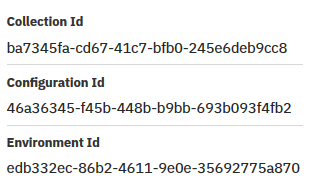

# Sample Codes - Integration of IBM Watson Discovery and ServiceNow

Node.js sample codes in this repo intend to show the **basic flow** of one integration use case between `Watson Discovery` and `ServiceNow`.

Additional utility sample codes are also available to help people who are new to Watson API.


## Use Case

There are many ways that `Watson Discovery` and `ServiceNow` can work together. We focus on one use case in this repo.

* Take `Knowledge` contents in `ServiceNow` and ingest into `Watson Discovery`


## Download Git Repo

Download Git Repo,

1. Start a `Terminal` window.

1. Download the repo,

	```
	cd  /tmp
	git clone https://github.com/lee-zhg/ingestWatsonDiscovery.git
	cd  /tmp/ingestWatsonDiscovery
	```


## Configuration

File `.env` must be created and configured for the appsample codes to connect to your services.

1. Go back to your `Terminal` window.

1. You should be in root folder of where you downloaded the repo. For example, `/tmp/ingestWatsonDiscovery`.

1. Creating a new `.env` file by copying the `.env.example` file.

	```
	cp  .env.example  .env
	```

1. Open file `.env` in a file editor.


### Configuring the Discovery service environment

1. Populate the following variables in the `.env` file based on your Assistant instance.

    ```bash
    # Watson Discovery
    DISCOVERY_URL=https://gateway.watsonplatform.net/discovery/api
    DISCOVERY_ENVIRONMENT_ID=4e6058d9-73b7-406e-95ce-145afab07f00
    DISCOVERY_COLLECTION_ID=f0f9541d-7583-4b87-b491-5f40a317de22
    DISCOVERY_IAM_APIKEY=xpm6QSsOTWwlmHF89sVyqjiuNmHQHHlUnJXNx0G9X6PB
	DOCUMENT_ID=
    ```
    
    To find Discovery URL and APIKEY,

    * Find and select your Discovery instance 
    * Navigate to the `Service credentials` tab.
    * Expand the `View credentials` under Actions in the right pane.

    To find DISCOVERY_ENVIRONMENT_ID and DISCOVERY_IAM_APIKEY,

    * Navigate to `Manage` tab of your Discovery instance.
    * Click `Launch tool`.
    * Click your collection.
    * Click the `View API details` icon next to the trash can icon.

    


### Configuring ServiceNow

1. Set `SNOW_AUTH` environment variable in file .env. It has two parts separated by a blank space. The first part is the value "Basic". The second part is `user:password` base64 encoded. You can get its value through any online base64 encoder based on your ServiceNow user:password.

1. Keep `application/json` as the value of `SNOW_CONTEXT_TYPE` environment variable.

1. Modify the hostname portion of `SNOW_REST_URL` environment variable to point to your ServiceNow system.

    ```bash
    #Sample ServiceNow settings in .env file
	MAXIMO_AUTH=BASIC RtaW46SUJNc2VydmljZT
	MAXIMO_CONTEXT_TYPE=application/json
	MAXIMO_REST_URL=https://dev626.service-now.com/api/now/table/kb_knowledge
    ```

1. Save the file.


## Run Sample Codes

For easy testing and verification, use a `Discovery` collection which does not contain any document while running sample codes.


### Installing and starting the app

1. In your `Terminal` window.

1. Install required Node.js modules to the local runtime environment:

    ```bash
    npm install
	npm audit fix
    ```

1. Start the Virtual HelpDesk:

    ```bash
    node  <sample code>
    ```


### Sample Code addDoc.js

Sample Code addDoc.js was created for people new to `Watson Discovery API`. It reads from sample file and ingest its content into the Discovery.

Sample content files can be found in `training` folder.

To run the sample code,

1. In your `Terminal` window.

1. Run command

	```
	node addDoc.js

	{
	  "document_id": "f89131f1-15cd-4f9f-9250-fc0871ec491e",
	  "status": "processing"
	}
	```

	>> Note: `"document_id": "f89131f1-15cd-4f9f-9250-fc0871ec491e"`. You would need it when running `deleteDoc.js` sample code.

1. Verify the document ingestion via the Discovery UI.


### Sample Code deleteDoc.js

Sample Code deleteDoc.js was created for people new to `Watson Discovery API`. It can also serve as utility tool to help remove testing files from the `Discovery`. 

`DOCUMENT_ID` is required to run the sample code. `DOCUMENT_ID` can found on the `Discovery` service UI when you view individual document. `DOCUMENT_ID` is also as part of output of sample code `addDoc.js` in the previous section.

> **Note: The sample code is NOT designed to remove large amount of documents**

To delete the document ingested into the Discovery in the previous section,

1. In the `Terminal` window.

1. Copy the `document_id` from the output of `addDoc.js` sample code executed in the previous section.

1. Update `DOCUMENT_ID` in the `.env` file and save.

1. Execute

	``` 
	node deleteDoc.js

	{
	  "document_id": "f89131f1-15cd-4f9f-9250-fc0871ec491e",
	  "status": "deleted"
	}
	```

1. Verify the document deletion via the `Discovery` UI.


### Sample Code snow2discovery.js

Sample Code snow2discovery.js was created to show the flow of the use case. It reads `Knowledge` contents in `ServiceNow` and ingest into `Watson Discovery`. For demo purpose, only the first couple entries of `Knowledge` will be ingested.

>> Note: verify your `ServiceNow` instance is in nornal condition before running the sample code

1. In your `Terminal` window.

1. Execute

	```
	node snow2discovery.js
	```
1. Verify ingested documents via the `Discovery` UI.


## License

This sample code is licensed under Apache 2.0. Full license text is available in [LICENSE](LICENSE).


## Contributing

See [CONTRIBUTING](CONTRIBUTING.md).


## Links

* [Cloud_Foundry CLI](https://github.com/cloudfoundry/cli#downloads)
* [Live Demo_URL](http://maximobot.mybluemix.net/)
* [Watson Assistant Documentation](https://console.bluemix.net/docs/services/conversation/getting-started.html#gettingstarted)
* [Watson Discovery Documentation](https://console.bluemix.net/docs/services/discovery/getting-started.html#gettingstarted)
* [Node.JS](http://nodejs.org/)
* [NPM](https://www.npmjs.com/)


